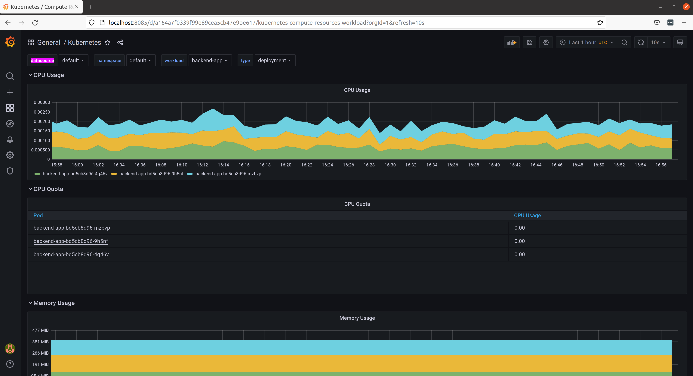
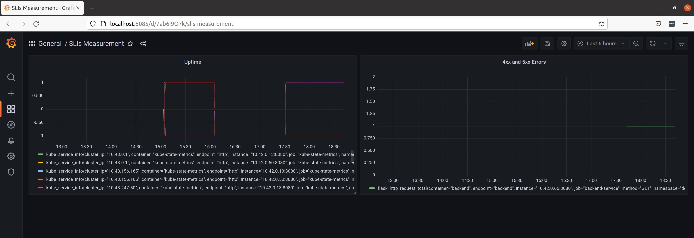
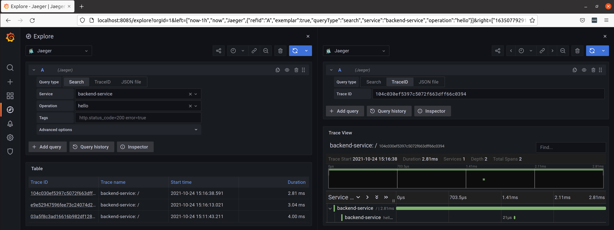
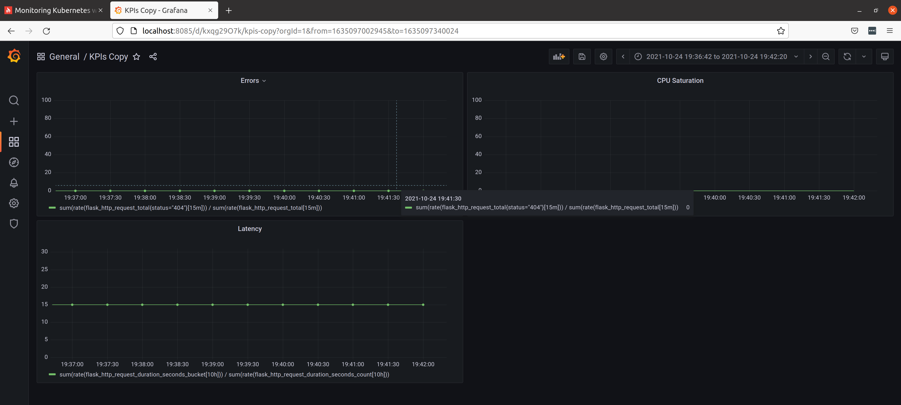

**Note:** For the screenshots, you can store all of your answer images in the `answer-img` directory.

## Verify the monitoring installation

*TODO:* run `kubectl` command to show the running pods and services for all components. Take a screenshot of the output and include it here to verify the installation


## Setup the Jaeger and Prometheus source
*TODO:* Expose Grafana to the internet and then setup Prometheus as a data source. Provide a screenshot of the home page after logging into Grafana.


## Create a Basic Dashboard
*TODO:* Create a dashboard in Grafana that shows Prometheus as a source. Take a screenshot and include it here.


## Describe SLO/SLI
*TODO:* Describe, in your own words, what the SLIs are, based on an SLO of *monthly uptime* and *request response time*.
The SLI are the minimum piece of measure to check if an objective defined in the SLO is being met, which will be used 
to offer a SLA to the customer. For example, when you work on the cloud, each cloud has a SLA which informs you of
how long your services will be running (monthly uptime). Going by these SLA you can calculate how much your service
will be also running, as you have to add to the cloud service downtime you own application downtime. This downtime is
measured with the SLI. 

## Creating SLI metrics.
*TODO:* It is important to know why we want to measure certain metrics for our customer. Describe in detail 5 metrics to measure these SLIs.
Going by https://sre.google/sre-book/service-level-objectives/ the four gold signals are:
Latency: Is the delay a service need to respond to a user request
Errors: Percentage of failed requests
Traffic: How much traffic does your service is using
Saturation: How utilised you infrastructure components are

The calculation of the four is done in prometheus with following formulas
***Latency***
```
sum(greeting_seconds_sum)/sum(greeting_seconds_count)  //Average
histogram_quantile(0.95, sum(rate(greeting_seconds_bucket[5m])) by (le)) //Percentile p95
```
***Request Rate***
```
sum(rate(greeting_seconds_count{}[2m]))  //Including errors
rate(greeting_seconds_count{code="200"}[2m])  //Only 200 OK requests
```
***Errors per secon***
```
sum(rate(greeting_seconds_count{code!="200"}[2m]))
```
***Saturation***
```
100 - (avg by (instance) (irate(node_cpu_seconds_total{}[5m])) * 100)
```


Other variations are ***USE*** (Utilization, Saturation and Errors) and ***RED*** (Rate, Error and Durability).

In order to calculate the SLIs you have the formula:

**SLI = Good Events * 100 / Valid Events**

A good SLI ties up directly with user experience. For example, if the SLI indicates a lower value, it should also lower customer satisfaction. If that is not the case, then the SLI is not good and not even worth measuring

## Create a Dashboard to measure our SLIs
*TODO:* Create a dashboard to measure the uptime of the frontend and backend services We will also want to measure to measure 40x and 50x errors. Create a dashboard that show these values over a 24 hour period and take a screenshot.
Errors: flask_http_request_total{status=~"4..|5.."}


## Tracing our Flask App
*TODO:*  We will create a Jaeger span to measure the processes on the backend. Once you fill in the span, provide a screenshot of it here.



## Jaeger in Dashboards
*TODO:* Now that the trace is running, let's add the metric to our current Grafana dashboard. Once this is completed, provide a screenshot of it here.


## Report Error
*TODO:* Using the template below, write a trouble ticket for the developers, to explain the errors that you are seeing (400, 500, latency) and to let them know the file that is causing the issue.

TROUBLE TICKET

Name: 404 Not Found on backend service

Date: 24/10/2021

Subject: Api endpoint not found

Affected Area: Backend service

Severity: HIGH

Description: The calls from frontend to the backend are returning a 404


## Creating SLIs and SLOs
*TODO:* We want to create an SLO guaranteeing that our application has a 99.95% uptime per month. Name three SLIs that you would use to measure the success of this SLO.
Error Rate -  The service might be available but not working properly
Uptime/Availability - The real downtime should also be monitored
Latency - It might be that the service is up and running but effectively not working at all
Saturation - Saturation is defined as the load on the resources of your server like network and CPU


## Building KPIs for our plan
*TODO*: Now that we have our SLIs and SLOs, create KPIs to accurately measure these metrics. We will make a dashboard for this, but first write them down here.


**Error Rate**
Number of Errors/second
Error Response Rate/second:
```
sum(rate(flask_http_request_total{status="404"}[15m])) / sum(rate(flask_http_request_total[15m]))
```

**Uptime**
Success Requests Percentage/second
Service latency should less than 0.5 seconds for >= 99.99% requests

**Latency**
Response Time average:
```
sum(rate(http_request_duration_seconds_bucket{le="0.4"}[1m])) / sum(rate(http_request_duration_seconds_count[1m]))
```

**Resource Usage/Saturation**
CPU Usage (Per Pod)
Memory Usage (Per Pod)
CPU Utilization (Per Node)
Memory Utilization (Per Node)

In this case I will only create a metric for the cpu saturation: Average cpu load:
```
container_cpu_load_average_10s
```


## Final Dashboard
*TODO*: Create a Dashboard containing graphs that capture all the metrics of your KPIs and adequately representing your SLIs and SLOs. Include a screenshot of the dashboard here, and write a text description of what graphs are represented in the dashboard.  



Links to dig deeper:
https://blog.mphomphego.co.za/blog/2021/07/25/How-to-configure-Jaeger-Data-source-on-Grafana-and-debug-network-issues-with-Bind-utilities.html
https://codersociety.com/blog/articles/loki-kubernetes-logging
https://www.elastic.co/guide/en/cloud-on-k8s/master/k8s-install-helm.html
http://www.inanzzz.com/index.php/post/yglp/export-and-import-grafana-dashboard-and-data-sources
https://community.wegalvanize.com/s/article/Adding-CA-certificates-to-keystore-1467234930157?language=en_US
https://traefik.io/blog/application-request-tracing-with-traefik-and-jaeger-on-kubernetes/
https://medium.com/opentracing/take-opentracing-for-a-hotrod-ride-f6e3141f7941
https://betterprogramming.pub/measuring-site-reliability-9745617d206c
https://www.squadcast.com/blog/the-key-differences-between-sli-slo-and-sla-in-sre
https://sysdig.com/blog/golden-signals-kubernetes/
https://www.devopsschool.com/blog/prometheus-promql-example-query/
https://github.com/simonpasquier/prometheus_workshop/blob/master/PromQL.md
https://blog.viktoradam.net/2020/05/11/prometheus-flask-exporter/
https://www.metricfire.com/blog/first-contact-with-prometheus/
https://blog.pilosus.org/posts/2019/06/01/grafana-dashboard-flask-app/
https://github.com/pilosus/flask_prometheus_metrics
https://www.replex.io/blog/kubernetes-in-production-the-ultimate-guide-to-monitoring-resource-metrics-with-grafana
https://www.metricfire.com/blog/monitoring-kubernetes-with-prometheus/


https://grafana.com/grafana/dashboards/12553
https://grafana.com/blog/2021/09/23/intro-to-distributed-tracing-with-tempo-opentelemetry-and-grafana-cloud/
https://signoz.io/blog/opentelemetry-vs-prometheus/
https://github.com/open-telemetry/opentelemetry-collector-contrib/blob/main/exporter/lokiexporter/README.md

NOTES:
- use OpenTelemetry (DONE)
- use ChaosEngineering
- use tls in the communication elastic - jaeger
- When you use traeffik the port forwards are being redirected by traffic, so it might not work. *TODO* Research ono this